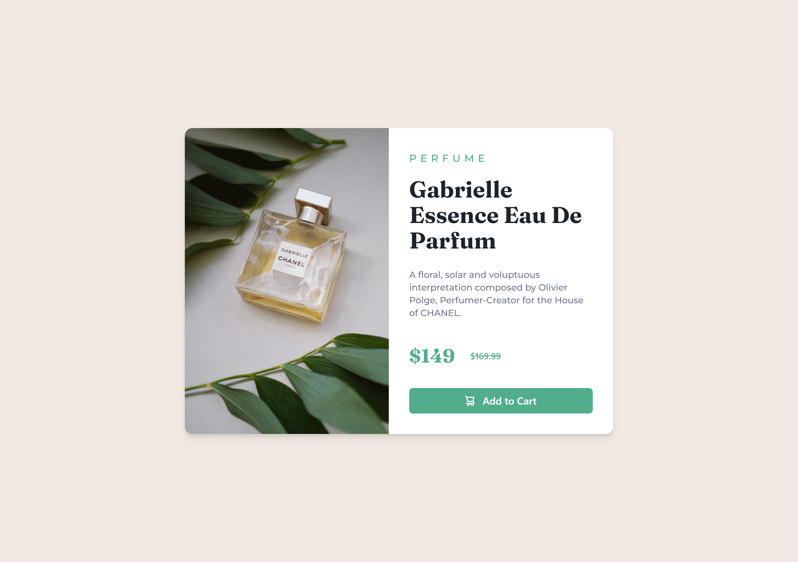

# Frontend Mentor - Product preview card component solution

This is a solution to the [Product preview card component challenge on Frontend Mentor](https://www.frontendmentor.io/challenges/product-preview-card-component-GO7UmttRfa). Frontend Mentor challenges help you improve your coding skills by building realistic projects. 

## Table of contents

- [Overview](#overview)
  - [The challenge](#the-challenge)
  - [Screenshot](#screenshot)
  - [Links](#links)
- [My process](#my-process)
  - [Built with](#built-with)
  - [Useful resources](#useful-resources)
- [Author](#author)
- [Acknowledgments](#acknowledgments)

## Overview

### The challenge

Users should be able to:

- View the optimal layout depending on their device's screen size
- See hover and focus states for interactive elements

### Screenshot

### Links

- Solution URL: [Add solution URL here](https://your-solution-url.com)
- Live Site URL: [Add live site URL here](https://your-live-site-url.com)

## My process

### Built with

- Semantic HTML5 markup
- CSS custom properties
- Flexbox
- Mobile-first workflow
- [React](https://reactjs.org/) - JS library
- [Tailwind Css](https://tailwindcss.com/) - For styles

### Useful resources

- [Feontend Mentor](https://www.frontendmentor.io/) 
- [Tailwind Css](https://tailwindcss.com/docs/installation)

## Author

- Website - [Saugat Rimal](https://wwwsaugatrimal.com.np)
- Frontend Mentor - [@saugatrimal](https://www.frontendmentor.io/profile/saugatrimal)
- Twitter - [@saugatrimal60](https://www.twitter.com/saugatrimal60)
- Instagram - [@saugatrimal60](https://www.twitter.com/saugatrimal60)

## Acknowledgments

 Frontend Mentor  is an awesome place to learn new thing and sharpen your skills.
